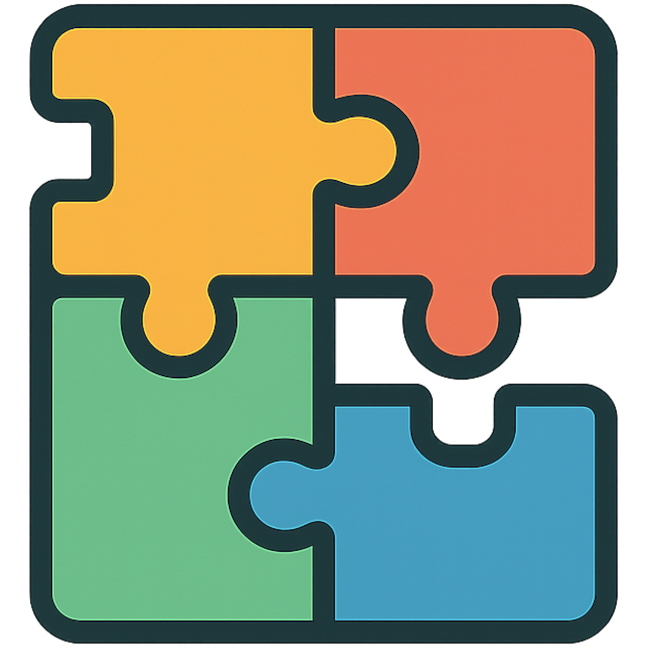
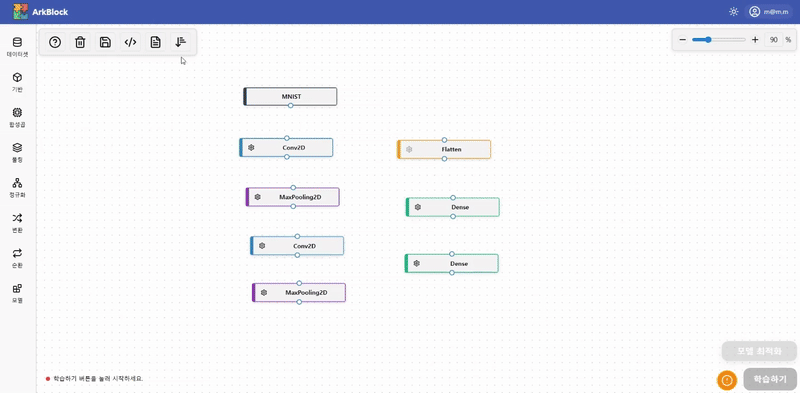
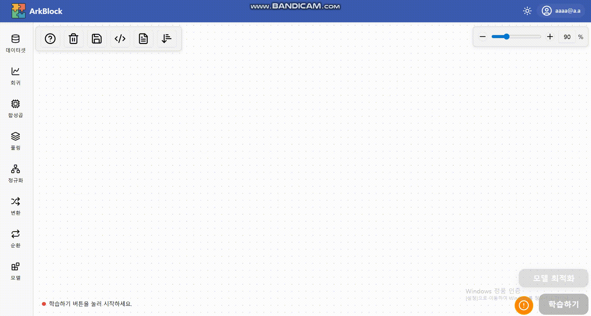
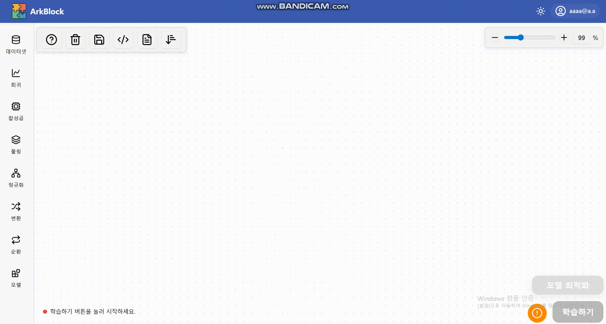
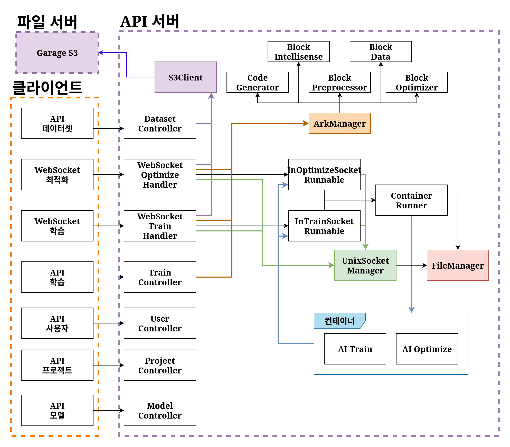
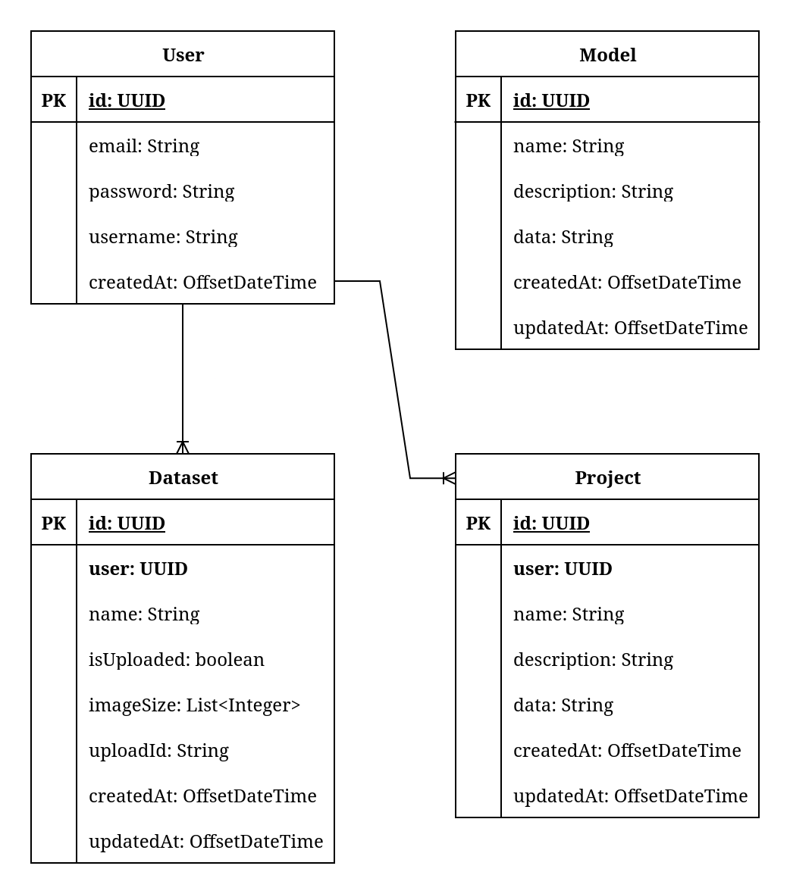

# Ark Block
<b>비주얼 스크립팅을 활용한 딥러닝 교육 지원 솔루션</b> 
 
 

<h3>"코딩 없이 AI모델의 학습과 최적화를 동시에"</h3>

> ARK BLOCK는 **Node 기반 시각적 설계 → 자동 코드 생성 → 하이퍼파라미터 최적화까지** 한 번에 제공하는  
> **교육용 Visual Deep Learning 플랫폼**입니다.

 

🌐Official Website: https://www.bit41.net/

 

## 1. 프로젝트 개요

### 1.1 프로젝트 배경 & 기획 의도

AI는 이제 우리 생활에 필수적이지만
여전히 **코딩이라는 진입 장벽**으로 인해 많은 학습자들이 실습 단계에서 어려움을 겪고 있습니다.

ARK BLOCK는 이러한 문제를 해결하기 위해  
**코드 없이도 딥러닝 모델의 구조를 직접 설계하고 실험할 수 있는 환경**을 목표로 기획되었습니다.

---

### 1.2 설계의 중점

- Visual Scripting을 통한 직관적인 모델 설계
- 세부 설정 & 레이어 자동 최적화
- 커스텀 데이터를 통해 나만의 데이터셋 활용

---

## 2. 핵심 기능

### 2.1 노드 기반 Visual Model구현
- 블록 연결 방식으로 딥러닝 레이어 구성
- 데이터 흐름과 모델 구조를 시각적으로 표현

---

### 2.2 자동 모델 최적화
- 모델 성능에 영향을 주는 파라미터 자동 탐색
- 사용자는 구조 설계와 결과 해석에 집중 가능

---

### 2.3 커스텀 데이터 기반 빠른 테스트
- 사용자 데이터 업로드 후 즉시 학습 및 평가
- 실험 중심 학습 및 검증 가능

---

## 3. 시스템 구조

### 3.1 전체 아키텍처

> 자세한 내용은 여기!!  🔍 [ArkBlock 아키텍쳐](./STRUCTURE.md)

- 클라이언트: 모델 설계 및 시각화
- 서버: 모델 코드 생성, 학습 실행, 최적화 처리

---

## 4. 데이터베이스 설계

- 기본 메타 데이터는 PostgreSQL에 저장
- 대용량 커스텀 데이터셋은 별도의 파일 서버(S3) 사용

---

## 기술 스택

<table>
<thead>
<tr>
<th>분류</th>
<th>주요 기술 스택</th>
</tr>
</thead>

<tbody>

<tr>
<td>개발 환경</td>
<td>

</td>
</tr>

<tr>
<td>개발 도구</td>
<td>

</td>
</tr>

<tr>
<td>개발 언어</td>
<td>

</td>
</tr>

<tr>
<td>라이브러리</td>
<td>

</td>
</tr>

</tbody>
</table>

---

## 6. 기대되는 효과

1. AI 기초 개념을 시각적으로 빠르게 이해 가능  
2. 코드 작성 부담 없이 모델 구조 학습 가능  
3. 자동 최적화를 통해 모델 설계에 집중  
4. 빠른 프로토타입 구성 및 테스트  
5. 실습 중심의 AI 학습 환경 제공  

---

## 7. 개선하고 싶은 방향

1. 서버 메모리 확장을 통해 여러 사용자 처리 개선  
2. Transformer 등 고급 레이어 확장  
3. 사용자 편의성을 고려한 UX 개선  

---

## 8. 팀 구성
비트고급 41기 1조
| 이름 | 담당 역할 |
|----|----|
| 성원빈 | AI 코드 생성, 최적화 로직, Python 모델 구현 |
| 박서연 | 모델 인텔리전스, 자동 전처리 |
| 정찬호 | 서버 아키텍처, API 및 DB 설계, Docker |
| 최정욱 | 통신 API 구현, UI/UX 기획 및 개발 |
| 천호준 | 클라이언트 기능 설계 및 구현 |

---

## 9. 실행 및 사용 가이드
👉 [Launch Guide](https://github.com/ghwns6404/ArkBlock/blob/main/LaunchGuide.md)
