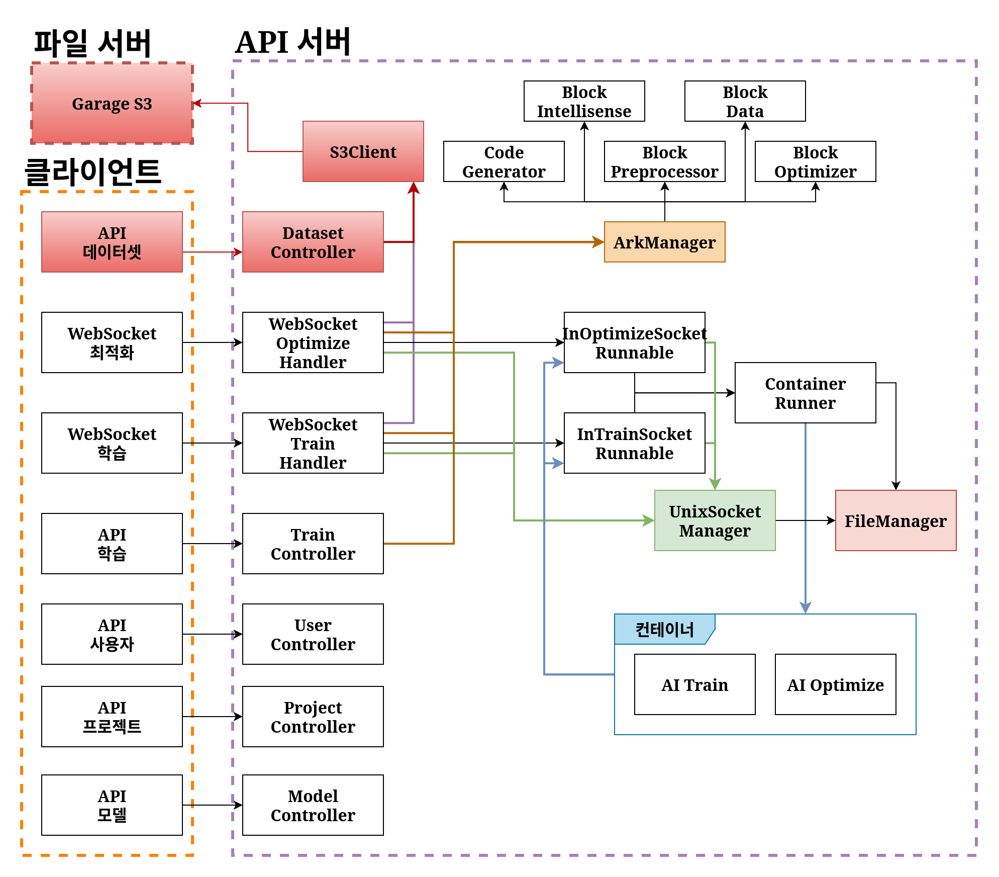
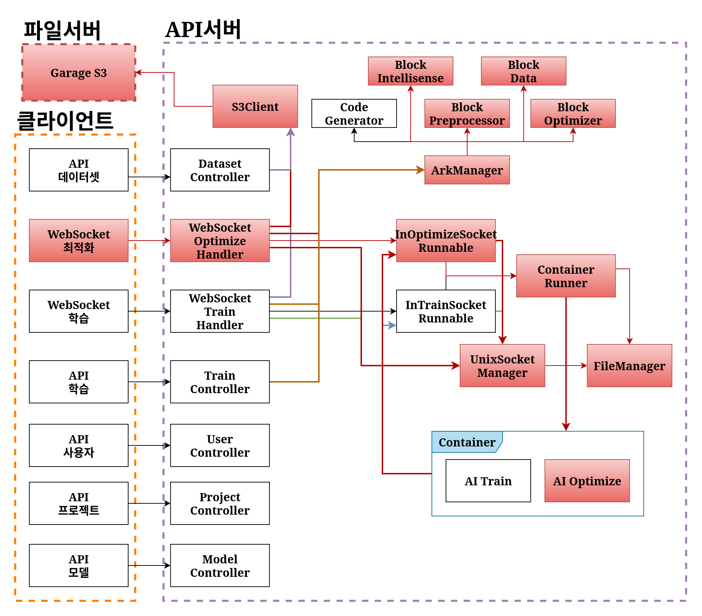
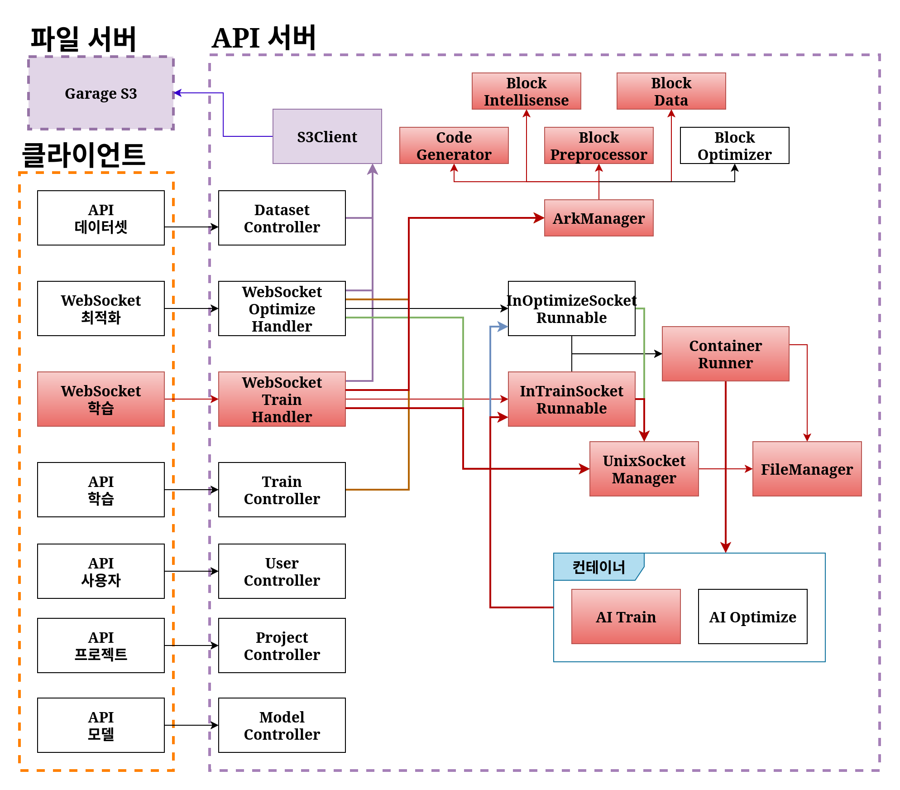
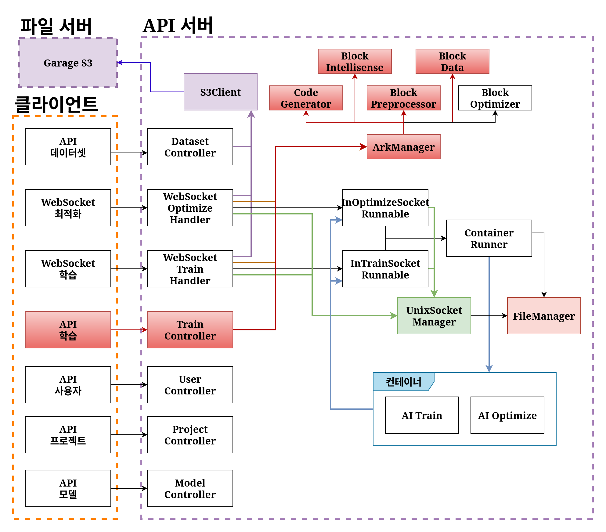
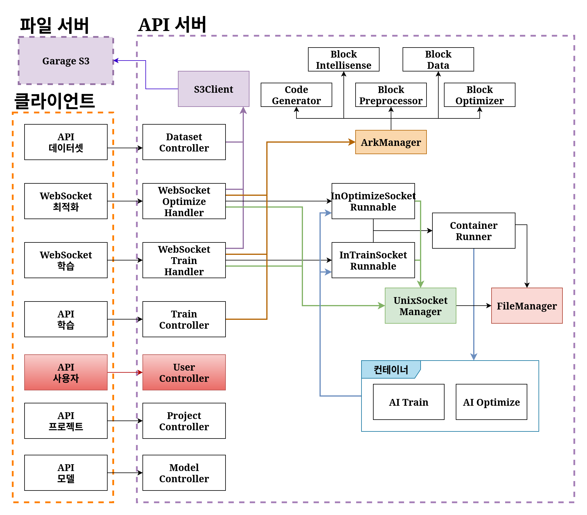
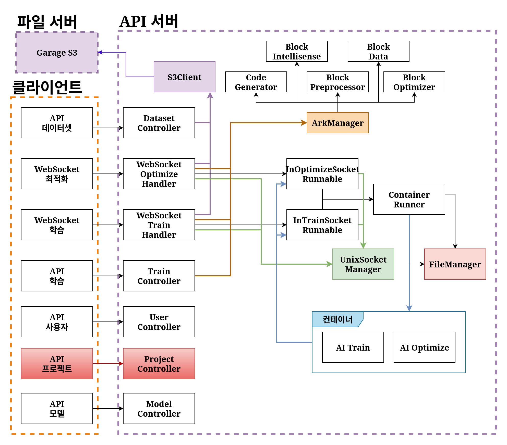

# 시스템 구조도

- STRUCTURE.md에서는 ArkBlock 프로젝트의 내부 아키텍처와
각 기능별 컴포넌트 간 상호작용을 설명합니다.

- 전체 구성도는 README.md를 참고하고
본 문서에서는 데이터셋 처리, 웹소켓 기반 학습/최적화,
코드 생성 로직의 실제 구현 흐름을 중심으로 다룹니다.

---

### 전체구성도 --> 데이터셋
> 전체 구성도는 README.md를 확인해주세요

사용자가 데이터셋을 직접 업로드할 때, DatasetController를 호출하고, S3Client를 통해 파일 서버에 있는 데이터셋에 접근합니다.

학습 데이터 특성상 용량이 클 수 밖에 없기 때문에, API 서버가 아닌 파일 서버에 별도로 저장합니다. 업로드할 파일이 크기 때문에 중간에 데이터를 중계하는 역방향 프록시 서버에서 타임아웃이 발생하거나 최대 용량 제한을 초과할 수 있어서, 기본적으로 클라이언트에서 앞서 언급한 것처럼 파일 조각을 나눠서 업로드합니다.

---

### 전체구성도 --> 최적화 웹소켓

클라이언트에서 모델 최적화를 진행했을 때에는, 핸들러에서 S3Client를 통해 데이터셋 파일을 구하고, ArkManager를 호출하여 최적화에 필요한 코드를 생성합니다.
그다음 ContainerRunner가 컨테이너를 생성하고, 소켓 Runnable과 UnixSocketManager를 통해 서로 통신합니다.

---

### 전체구성도 --> 학습 웹소켓

클라이언트가 학습할 때, 최적화와 유사한 구조를 갖습니다.
핸들러에서 ArkManager를 통해 학습 코드를 생성하고, 해당 코드를 ContainerRunner로 컨테이너를 실행합니다.
또한, 소켓 Runnable과 UnixSocketManager를 통해 UNIX 소켓으로 컨테이너와 통신합니다.

---

### 전체구성도 --> 코드생성 / 인텔리센스

학습 API는 클라이언트가 파이썬 코드를 생성하거나 인텔리센스를 통해 블록 오류를 확인할 때 사용합니다.
TrainController에서 ArkManager를 호출하여 오류 검증과 코드 생성 작업을 진행합니다.

---

### 전체구성도 --> 사용자 웹소켓

사용자 관련 API 요청은 REST API형식으로 통신합니다

---

### 전체구성도 --> 프로젝트 웹소켓

프로젝트 관련 API또한 REST API형식으로 통신합니다

- 모델 웹소켓 문서 추가하기!!

-  BI56 - 61 추가하기

-  P41 , 48 - 53추가하기

